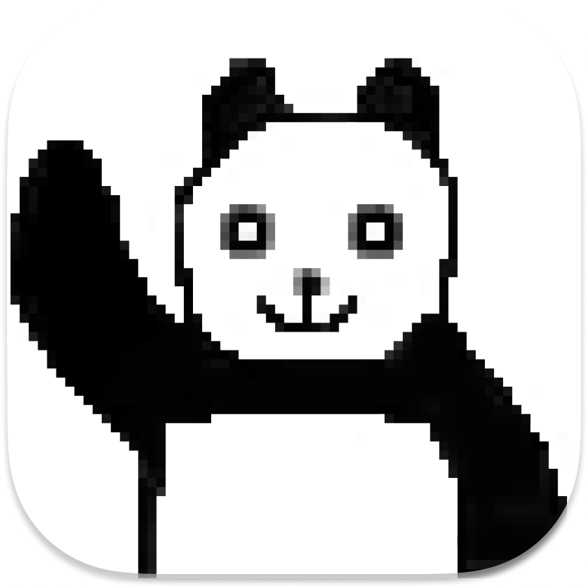

<p align="center">
  
</p>

# Nudge
A gentle desktop companion for a more balanced day at your screen.

## The problem
It's easy to stay at a computer longer than intended. A timer alone can be easy to ignore, especially when it interrupts at the wrong moment or offers nothing useful to do.

Nudge makes screen time tangible with a desktop companion that gets tired as your active work stretch grows. Its reminders wait for a natural moment, and a break can be a quick eye rest, stretch, breath, or walk.

## Features
- Visual progression: character animation depends on time spent on computer without a break
- Taking a break will restore the character: resting long enough to compensate for time spent without break will recover the companion
- Choose a crab, panda, red panda, tuxedo cat, or capybara, with detailed pixel-art sprites and expressive movement
- Pick a warm bamboo or dark forest appearance; resize your pet from 50% to 150% in Settings
- App awareness: waits for a stable category, puts the old activity away, and eases into the next
- Looks toward your pointer, enjoys strokes and clicks, and can be picked up and dragged
- Drop near a window’s top edge to perch there; the pet follows that window without activating it
- Takes short walks to sniff a growing flower, with longer quiet stretches during focused work
- Respects Reduce Motion and pauses wandering during interaction, reminders, and breaks
- Context-aware phrases: says phrases based on what you're doing (coding, gaming, social, etc.) and how tired the companion is
- Configurable reminder rhythm, ten-minute snooze, automatic-break threshold, screen position, monitor, and per-app categories
- Refreshes installed apps on every launch and when Settings opens, removes deleted apps, and preserves custom categories for apps you still have
- Reminders wait until you return from an idle stretch or finish passive media
- Four timed reset ideas, with clear steps and a visible countdown; every pause can be ended early
- Activity summary: time per category, breaks taken/interrupted, longest stretch, ~31 days of history
- Launch at login and a customizable global shortcut for hiding the companion
- Personal reminder notes that your companion can say at the next reminder
- A small hover status shows the current stretch and time until the next reminder

## Challenges
- Overlay window that stays out of the way: ignoring mouse events until you hover or click on character
- Mac-specific apis (focused app detection, idle-input monitoring, cursor tracking) not implemented on windows (cuz i only got a mac)
- Break awareness: watching for keyboard/mouse activity to end break early

## The future
- Windows support
- More activity insights and additional character accessories

## Installation

Download the macOS installer from [GitHub Releases](https://github.com/B-Eddie/nudge/releases/latest).
The universal DMG supports Apple silicon and Intel Macs. Open it and drag **nudge** into **Applications**.

This community build is not notarized. If macOS blocks it, review the app in **System Settings → Privacy & Security** and use **Open Anyway**.

### Build from source

Requirements: macOS, [Node.js](https://nodejs.org/), [Rust](https://rustup.rs/), and [Tauri prerequisites](https://v2.tauri.app/start/prerequisites/).

```bash
git clone https://github.com/B-Eddie/nudge.git
cd nudge
npm ci

# Run in development
npm run tauri dev

# Build for the current Mac
npm run tauri build

# Build a universal installer
rustup target add aarch64-apple-darwin x86_64-apple-darwin
npm run tauri build -- --target universal-apple-darwin
```

## Companion artwork

The live desktop pet and picker use generated transparent pixel-art sprite sheets in
`src/assets/pets/pixel/`. Each of the five companions has sixteen expressions and poses:
idle, blink, pleased, delighted, curious, lifted, yawning, sleeping, two walking steps,
stretching, grooming, coding, reading, listening to music, and gaming.

Generation used the built-in ImageGen tool; full prompts are recorded in
`src/assets/pets/pixel/PROMPTS.md`. The original atlases stay intact. The renderer samples
isolated pose artwork onto a 60-pixel canvas with nearest-neighbor scaling, stable body
scale, and a shared floor. Pose bounds follow the actual connected artwork rather than
fixed grid lines, preventing clipped ears and neighboring-frame fragments. Walking
frames are normalized to one facing direction. App changes still wait for a stable
category and a neutral settling pose.

Blinks and little habits have variable timings. Cats favor grooming; capybaras favor
yawns and curious pauses; tired companions yawn more. Focus work gets longer quiet stretches.
Petting follows a pleased → delighted → settled sequence, and dragging takes priority
over other reactions. Menus, direct attention, and Reduce Motion pause automatic habits.

Previous rendered illustrations and legacy crab art remain available in `src/assets/pets/`
and `src/assets/characters/crab/`; the legacy art retains its original attribution and license.

## Interacting with your companion

Click to pet, move your pointer over it to stroke it, or drag to pick it up.
Right-click or use the small **···** button for breaks, settings, notes, and your summary.
Keyboard users can Tab to the pet and press Space/Enter to pet it, or Shift+F10 to open its actions.
Settings → **Your companion → Character size** previews sizes from 50% to 150%.
Use **Reset** for the original size, then **Save** to apply. Cancel discards the preview.
Position is retained while opening panels; a new launch uses the corner selected in Settings.
Perching uses macOS window bounds only, without screenshots or controlling other apps.
If the window closes or leaves the current Space, the pet stays where it was.

Run `npm test` for gesture and behavior timing regression tests and `npm run build` for the frontend check.
